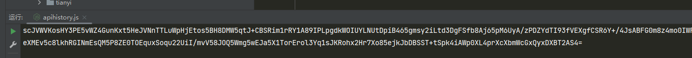

- https://www.aqistudy.cn/historydata/
- 该站有很强的反调试措施，需要使用油猴脚本在页面渲染后，插入我们的脚本来对网站的反调试进行一些处理

- 处理脚本如下，使用油猴进行挂载注入
~~~~
var debugflag = false;
  document.onkeydown = {}
  document.onkeydown = {}
  document.oncontextmenu = function() {}
  window.innerWidth = 0
  window.innerHeight = 0
  window.outerWidth = 0
  window.outerHeight = 0
   
  Function.prototype.constructor_ = Function.prototype.constructor;
  Function.prototype.constructor = function (a) {
        // 如果参数为 debugger，就返回空方法
        if(a == "debugger") {
            return function (){};
        }
        // 如果参数不为 debugger，还是返回原方法
        return Function.prototype.constructor_(a);
    };
~~~~
- 主要目的绕过网站的调试检测和无限debug
- 需要注意的是注入时机要在 渲染前 `// @run-at       document--start` 否则你将无法第一时间绕过进而无法抓包和调试

- 经过初步探查，该接口的请求参数和返回结果都为密文数据。
- 通过全局搜索关键字无法获取有用信息

- 改变策略通过 hook JSON.parse 进行尝试
- 发现会发生页面跳转，hook这个手段并不好使，改变策略通过 XHR 断点定位

- 很快追踪到密文踪迹
- 沿着堆栈往上找
发现了参数位置

- 发现上方所有代码即是我们的目标代码，新建一个js文件将代码抠出
- 通过控制台输出获取原始参数

- 根据报错补全缺失代码,轻松获取加密参数

- 我们发现这是一个标准的 ajax格式，下方就有我们的解密目标

- 通过控制台输出，这就是我们的目标

- 直接抠出，验证，至此加密和解密就都结束了

- 后续只需将对应方法进行重新封装配合 Web api 就可以构建加解密服务了，总得来说没什么太大难度
- 主要的反爬点在于反调试，对于反调试的处理很关键，尤其是把控注入时机，否则你将无法开启调试。

