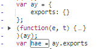

# 目标
- 某娱乐指数，搜索接口
- https://www.chinaindex.net/
- https://www.chinaindex.net/iIndexMobileServer/mobile/comm/getSearchResult
- 经过抓包发现，加密参数包含签名，返回结果中数据为加密数据。

- 通过全局搜索 `sign:` 发现 疑似参数点

- 下断点后发现，接口并未通过该地方，故直接排除。
- 通过 XHR 下断点 `comm/getSearchResult`
- 发送请求后，发现疑似跳转位

- 通过控制台输出 a 发现为空，通过堆栈往回找。
- 发现疑似目标，下断点，放行请求，重新进行捕获

- 发行发现，下方断点为 密文信息

- 先处理密文解密
经过单步调试跟踪意外发现 sign 踪迹，直接追踪 sign，放掉请求

- 在该处下断点，发起新请求,发现原始参数

- 经过单步调试发现疑似sign生成位置

- 赋值到控制台输出

- 与sign相似，单步过，记录目标值，快速放掉请求，找刚刚那个请求包进行验证

- 经过对比验证，就是我们要找的sign生成位置，跟踪该位置

- 抽离关键部位

- 通过全局搜索定位 hea

- 抠出上方 JavaScript 代码进行调试，用nodejs调试代码

- 根据报错内容，缺啥补啥，依次抠出缺失代码，还原部分见 21.js
- 回头找返回数据解密部分，通过刚才的调试，发现单步调试找解密效率太低，转换思路，返回加密数据为字符串类型，开发者为了更好的渲染数据，大概率会通过JSON.prase将最后的解密明文数据转化为对象形式，故，直接对JSON.prase进行Hook
~~~
(function() {
    var parse = JSON.parse;
    JSON.parse = function(params) {
        debugger;
        return parse(params);
    }
})();
~~~

- 通过浏览器自带的调试代码块功能，载入我们自己的代码块，对JSON.prase 进行hook

- 放掉所有断点，重新发请求。

- 捕获密文数据，放行，第二次捕获到明文数据

- 根据调用堆栈往回找一个，并打下断点

- 经过调试，锁定目标

- 目标结构疑似 AES 加密，尝试使用标准 AES 进行解密，补全缺失参数，根据报错信息，缺啥补啥，最后还原结果为 12.js

- 经过验证，确实是标准 AES 