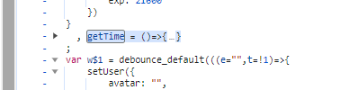
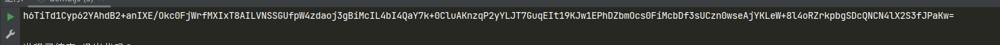

- https://www.spolicy.com/typePolicy?id=6&name=%E5%85%AC%E7%A4%BA%E5%85%AC%E5%91%8A
- 该站设置有反调试措施，使用无限debug+内存爆破手段，让我们无法进行调试。
- 解决方案用油猴注入我们的 反反调试代码，直接从构造器入手，把 `debugger` 置空
- 直接在渲染前注入，发现页面直接卡死，根本不往下执行，转换策略，使用控制台注入
- 调出控制台后输入以下代码
~~~
Function.prototype.constructor_ = Function.prototype.constructor;
  Function.prototype.constructor = function (a) {
        // 如果参数为 debugger，就返回空方法
        if(a == "debugger") {
            return function (){};
        }
        // 如果参数不为 debugger，还是返回原方法
        return Function.prototype.constructor_(a);
    };
~~~

- 在控制台注入后，我们的卡的 debugger就可以直接放行了，进而开始我们的调试
- 在抓包前注意提前登录，接口数据不登录的话无法获取后边的数据。
- 观察目标接口发现请求参数有加密

- 此外 headers中也包含了加密参数

- 通过全局搜索，发现有多处 `encrypt(` 踪迹，且代码中包含了很多 CryptoJS 使用 AES 加密的过程。
- 猜测网站使用的 AES 加密，在几处可疑的地方打下断点开始调试

- 通过抓包比对，发现了 `Authorization` 的生成位置。
- 根据调用栈跟踪发现了加密前的最初位置

- 扣出关键代码
~~~
n[c(818, "WEkc", 501, 285)](Y$2, l + "." + n[r(286, 659, 343, 62, "d8J0")](getTime)))
~~~
- 控制台输出填补混淆
~~~
n['aTOOH'](Y$2, l + "." + n['StDNO'](getTime))
~~~
- 上方寻找 l
~~~
const l = n[u(529, 766, "WEkc", 893)](getAuthToken);
// 填补后
const l = n['futKF'](getAuthToken);
~~~
- 还原 `getAuthToken`
~~~
getAuthToken = ()=>{
    if (authToken)
        return authToken;
    const e = storage.get("AuthToken"); // 从内存中取值，疑似登录的 Token
    return e && (authToken = e),
    authToken
}
~~~
- 发现这就是个定值
~~~
storage.get("AuthToken") =>'eyJwYXNzd29yZCI6IiIsImV4cCI6MTcxODAyOTg5NCwidXNlcm5hbWUiOiIxNTAxNjI5OTcwNyJ9'
~~~
- 根据控制台输出 ，l 就等于这个 定值
- 简化
~~~
l = 'eyJwYXNzd29yZCI6IiIsImV4cCI6MTcxODAyOTg5NCwidXNlcm5hbWUiOiIxNTAxNjI5OTcwNyJ9'
~~~
- 寻找 n，在上方发现n的踪迹

- 创建一个 js文件放置, 把已知信息填入

- 发现还缺乏 getTime 和 Y$2
- 找到对应目标扣取代码

- 在扣 Y$2 时我们发现代码逻辑比较复杂，硬扣的话可能会耗费很多时间，而且还容易扣错。
- 通过观察发现，这里的加密算法用的是 RSA 算法，且我们在扣代码过程中已经发现了公钥。
- 直接通过公钥配合 jsencrypt 进行RSA 加密查看效果
- 成功获得了密文

~~~
window = global
const JSEncrypt = require('jsencrypt');

const publicKey = "MIGfMA0GCSqGSIb3DQEBAQUAA4GNADCBiQKBgQC722C7ttJlCvRGTul0rb63Aj39Fnft/WNAHW5HFRqSgu7yWXBe9RaT/7r8nIzC+jAy2og0HBckt911CP73bpnHs6SlKh7JCnzn7mtyiuWUl3MspdP+lrTML/m1KJKOi3St9iDXR1f5sANv87akuxQcJNgBdXuRin8MSI24wiKZKQIDAQAB"

getTime = ()=>{
    const e = 43
    return timeDiff = e,
    (new Date).getTime() + e
}
const l = 'eyJwYXNzd29yZCI6IiIsImV4cCI6MTcxODAyOTg5NCwidXNlcm5hbWUiOiIxNTAxNjI5OTcwNyJ9'

const encrypt = new JSEncrypt();
encrypt.setPublicKey(publicKey);
// console.log(getTime())
console.log(encrypt.encrypt( l + "." + getTime(),publicKey))
~~~

- 通过调用栈追踪发现请求参数加密位置

- 扣出目标代码
~~~
i['data'] = d['encode'](i['data'])['finish']()['slice']()
// 填充后
~~~
- 往上查探拦截器的 参数形成，发现原始参数
~~~
{
    "pageNum": 9,
    "pageSize": 20,
    "policyType": 6,
    "sort": 0,
    "centralId": "",
    "province": "",
    "city": "",
    "downtown": "",
    "garden": ""
}
~~~
- 直接可替换 `i['data']`
- 现在缺乏最后的参数 d
- 往上找 d , 并简化后
~~~
const d = root['lookupType']('PolicyInfoByTypeIdParam')
~~~
- 继续通过搜索 找root,然后根据缺失补全

- 调用后报错

- 搜索 `commonjsGlobal =` 找到目标进行补全。
- 调用后发现 找不到PolicyInfoByTypeIdParam

- 怀疑藏在了虚拟内存中临时构建的匿名函数，通过断点处直接跳转到目标
~~~
(function anonymous(Writer,types,util
) {
return function PolicyInfoByTypeIdParam$encode(m,w){
  if(!w)
  w=Writer.create()
  if(m.policyType!=null&&Object.hasOwnProperty.call(m,"policyType"))
  w.uint32(10).string(m.policyType)
  if(m.centralId!=null&&Object.hasOwnProperty.call(m,"centralId"))
  w.uint32(18).string(m.centralId)
  if(m.province!=null&&Object.hasOwnProperty.call(m,"province"))
  w.uint32(26).string(m.province)
  if(m.city!=null&&Object.hasOwnProperty.call(m,"city"))
  w.uint32(34).string(m.city)
  if(m.downtown!=null&&Object.hasOwnProperty.call(m,"downtown"))
  w.uint32(42).string(m.downtown)
  if(m.garden!=null&&Object.hasOwnProperty.call(m,"garden"))
  w.uint32(50).string(m.garden)
  if(m.sort!=null&&Object.hasOwnProperty.call(m,"sort"))
  w.uint32(56).uint32(m.sort)
  if(m.pageNum!=null&&Object.hasOwnProperty.call(m,"pageNum"))
  w.uint32(64).uint32(m.pageNum)
  if(m.pageSize!=null&&Object.hasOwnProperty.call(m,"pageSize"))
  w.uint32(72).uint32(m.pageSize)
  if(m.homePageFlag!=null&&Object.hasOwnProperty.call(m,"homePageFlag"))
  w.uint32(80).uint32(m.homePageFlag)
  return w
}
})
~~~
- 现在缺乏Writer 根据断点跳转，发现这是个webpack
- 老办法，对齐进行改造，让他成为标准的webpack，然后用外部变量接收加载器

- 这样我们就可以通过我们自己的变量来控制Writer的创建
- 调用发现报错了

- 这是缺少了 window 环境，使用 JSDOM进行补全
~~~
const {JSDOM} = require("jsdom")

dom = new JSDOM()
window = dom.window
~~~
- 验证成功输出结果

