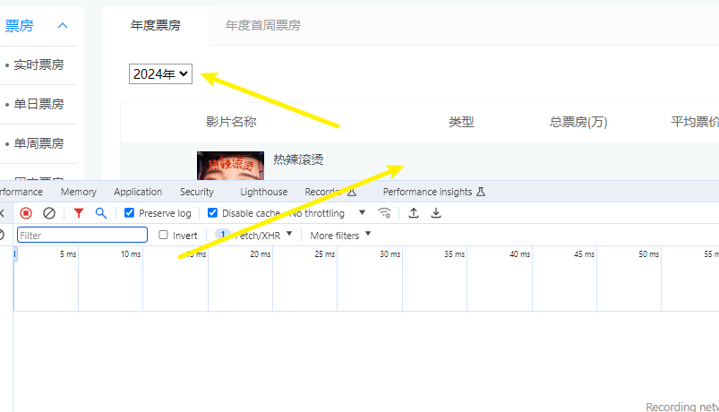
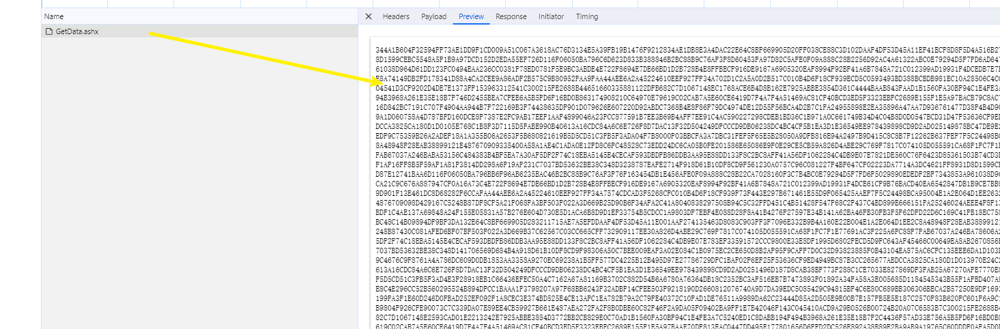
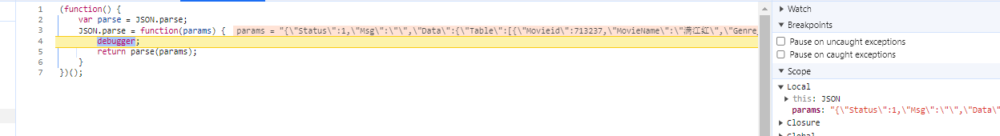
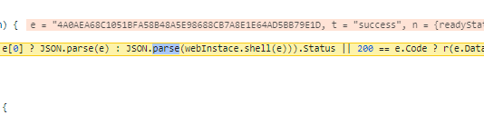
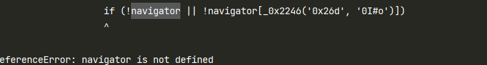
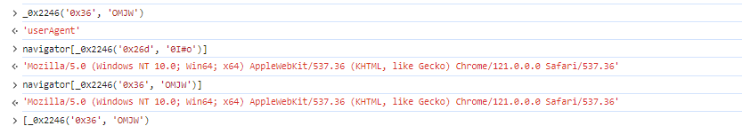
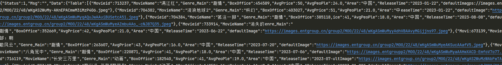
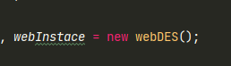

- https://www.endata.com.cn/BoxOffice/BO/Year/index.html
- 目标接口 ：https://www.endata.com.cn/API/GetData.ashx

- 通过切换上方年份来触发接口
- 经过探查发现，返回的结果为密文数据

- 定位这种返回结果为密文的最有效方式就是 hook JSON.prase , 在尝试全局搜索无果后就可以直接hook

- 很快通过hook我们就锁定了明文，沿着调用堆栈往回找

- 很快就发现这就是我们的目标
~~~
JSON.parse(webInstace.shell(e)))
~~~
- 通过控制台输出 `e` 和 `webInstace.shell(e)` 就可以知道
- `e` 就是密文，`webInstace.shell(e)` 就是明文,锁定目标直接跟栈
- 抠出必要代码如 demo.js

- 调试根据报错缺啥补啥

- 使用置空法
~~~
navigator = {}
~~~
- 发现最终返回结果为空串，所以navigator中必定有必要的参数
- 去代码中寻找缺失的部分，对代码进行补全

- 发现只缺失了 `userAgent` 补全后，成功获取明文 
~~~
navigator = {
    "userAgent":"Mozilla/5.0 (Windows NT 10.0; Win64; x64) AppleWebKit/537.36 (KHTML, like Gecko) Chrome/121.0.0.0 Safari/537.36",
}
~~~

- 扩展，通过代码观察，发现这是一个DES的加密算法

- 进一步扣代码，配合 `CryptoJS` 库进行还原，优化后代码如下
~~~
const CryptoJS = require("crypto-js");
var _0x51eedc = {
    'pKENi': function _0x2f627(_0x5b6f5a, _0x440924) {
        return _0x5b6f5a === _0x440924;
    },
    'wnfPa': 'ZGz',
    'VMmle': '7|1|8|9|5|2|3|6|0|4',
    'GKWFf': function _0x1a4e13(_0x40cfde, _0x16f3c2) {
        return _0x40cfde == _0x16f3c2;
    },
    'MUPgQ': function _0x342f0d(_0x19038b, _0x4004d6) {
        return _0x19038b >= _0x4004d6;
    },
    'hLXma': function _0x55adaf(_0x45a871, _0x161bdf) {
        return _0x45a871 + _0x161bdf;
    },
    'JdOlO': function _0x13e00a(_0x5899a9, _0x4bb34d) {
        return _0x5899a9 + _0x4bb34d;
    },
    'qrTpg': function _0x1198fb(_0x55b317, _0x22e1db, _0x1b091a) {
        return _0x55b317(_0x22e1db, _0x1b091a);
    },
    'pdmMk': function _0xe2b022(_0x4af286, _0x4c2fd4) {
        return _0x4af286 - _0x4c2fd4;
    },
    'xVKWW': function _0x1094a3(_0x5f3627, _0x2a0ac5, _0x3ad2e5) {
        return _0x5f3627(_0x2a0ac5, _0x3ad2e5);
    }
};
var _0x4da59e = {
    'bUIIa': function _0x2a2af9(_0x779387, _0x4a4fec) {
        return _0x779387 + _0x4a4fec;
    }
};
var _0x9843d3 = function (_0x29d556, _0xcc6df, _0x3d7020) {
    if (0x0 == _0xcc6df)
        return _0x29d556['substr'](_0x3d7020);
    var _0x48914b;
    _0x48914b = '' + _0x29d556['substr'](0x0, _0xcc6df);
    return _0x48914b += _0x29d556['substr'](_0x4da59e['bUIIa'](_0xcc6df, _0x3d7020));
};

mydecrypt = function (ciphertext) {
    var _0x554c90 = _0x51eedc['JdOlO'](_0x51eedc['qrTpg'](parseInt, ciphertext[_0x51eedc['pdmMk'](ciphertext['length'], 0x1)], 0x10), 0x9)
        , _0x2cf8ae = _0x51eedc['xVKWW'](parseInt, ciphertext[_0x554c90], 0x10);
    ciphertext = _0x9843d3(ciphertext, _0x554c90, 0x1);
    _0x554c90 = ciphertext['substr'](_0x2cf8ae, 0x8);
    ciphertext = _0x9843d3(ciphertext, _0x2cf8ae, 0x8);
    _0x2cf8ae = CryptoJS['enc']['Utf8']['parse'](_0x554c90);
    _0x554c90 = CryptoJS['enc']['Utf8']['parse'](_0x554c90);

    return CryptoJS["DES"]['decrypt']({
        'ciphertext': CryptoJS['enc']['Hex']['parse'](ciphertext)
    }, _0x2cf8ae, {
        'iv': _0x554c90,
        'mode': CryptoJS['mode']['ECB'],
        'padding': CryptoJS['pad']['Pkcs7']
    })['toString'](CryptoJS['enc']['Utf8']);
}

module.exports = mydecrypt
~~~
