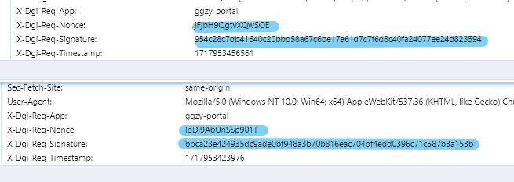
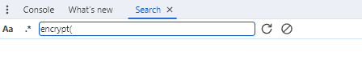
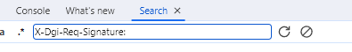
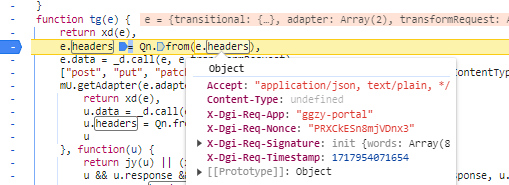
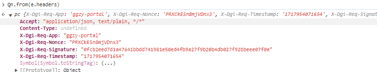
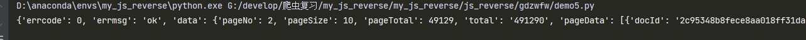

# 目标
- https://ygp.gdzwfw.gov.cn/ggzy-portal/search/v2/items

- 经过探查发现在 headers中含有部分加密参数
- 全局搜索 `encrypt` 无效

- 搜索其他关键词 `X-Dgi-Req-Signature:`同样无效

- 改变策略，打 XHR 断点 `ggzy-portal/search/v2/items`
断到点，沿着调用堆栈往回查找，多断点发现半密文

- 控制台输出发现，此处就是生成所有密文的地方

- 调用堆栈走到此处，为半密文状态，再往前找的话就是异步堆栈了
- 根据异步request构成，想要修改参数必定有拦截器，跟踪异步函数，分析headers被处理的部分
- 发现 Nonce hne(16) 构建，抠出以下代码
~~~
const lF = "zxcvbnmlkjhgfdsaqwertyuiop0987654321QWERTYUIOPLKJHGFDSAZXCVBNM"

function hne(e) {
    return [...Array(e)].map(() => lF[dne(0, 61)]).join("")
}

function pne(e) {
    let t = "";
    return typeof e == "object" ? t = Object.keys(e).map(n => `${n}=${e[n]}`).sort().join("&") : typeof e == "string" && (t = e.split("&").sort().join("&")),
        t
}
~~~
- 继续往下，通过多次断点调试发现 signature 由 Nonce + "k8tUyS$m" + data_url_倒序 + timestamp 组成的字符串再 通过 SHA256 计算后获得
- 验证算法结果后，重构 JS 代码，如下
~~~
const CryptoJS = require("crypto-js");
function dne(e, t) {
    switch (arguments.length) {
        case 1:
            return parseInt(Math.random() * e + 1, 10);
        case 2:
            return parseInt(Math.random() * (t - e + 1) + e, 10);
        default:
            return 0
    }
}

const lF = "zxcvbnmlkjhgfdsaqwertyuiop0987654321QWERTYUIOPLKJHGFDSAZXCVBNM"

function hne(e) {
    return [...Array(e)].map(() => lF[dne(0, 61)]).join("")
}

function pne(e) {
    let t = "";
    return typeof e == "object" ? t = Object.keys(e).map(n => `${n}=${e[n]}`).sort().join("&") : typeof e == "string" && (t = e.split("&").sort().join("&")),
        t
}
// 入口
/*
->  data 结构顺序都不可调换
    data = {
        "type": "trading-type",
        "openConvert": false,
        "keyword": "",
        "siteCode": "44",
        "secondType": "A",
        "tradingProcess": "",
        "thirdType": "[]",
        "projectType": "",
        "publishStartTime": "",
        "publishEndTime": "",
        "pageNo": 49, # 可变值
        "pageSize": 10
    }
*/
function u(data) {
    const
        a = Date.now()
        , l = hne(16)
        , c = "k8tUyS$m"
        , d = {
            ['X-Dgi-Req-App']: 'ggzy-portal',
            ['X-Dgi-Req-Nonce']: l,
            ["X-Dgi-Req-Timestamp"]: a
        };
 
    let queryString = Object.keys(data)
        .map(key => `${encodeURIComponent(key)}=${encodeURIComponent(data[key])}`)
        .join('&');
    var r = pne(queryString)
    var message = l + c + decodeURIComponent(r) + a
    const p = CryptoJS.SHA256(message)
    d[['X-Dgi-Req-Signature']] = p.toString(CryptoJS.enc.Hex)
    return d
}

/*
结果如下：
{
  'X-Dgi-Req-App': 'ggzy-portal',
  'X-Dgi-Req-Nonce': 'ZhxTWW9yr7WtX4Sn',
  'X-Dgi-Req-Timestamp': 1717665828059,
  'X-Dgi-Req-Signature': '4fc7144009a5250ad9ea1cae38f42ce73148f006e119bda6e63d7239d9027ad9'
} 

将该结果同步到 headers 即可 

*/
~~~
- 编写简易的代码对 结果进行验证

- 此次 headers 加密过程藏匿与 异步函数中，跟栈极容易跟丢，需要反复分析打断点验证，综合难度较高。
- 注意：该逆向经验提供学习参考，严禁对他人系统进行大规模请求和破坏！否则后果自负。