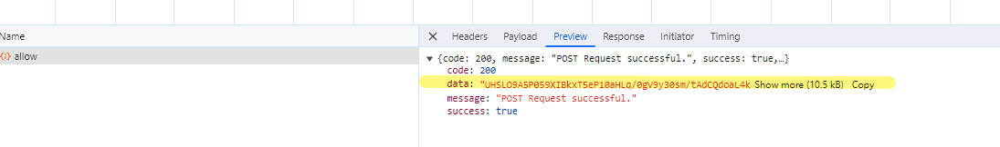

- https://www.kaogujia.com/
- 目标搜索接口：https://service.kaogujia.com/api/userstaging/discover/allow

- 通过探查发现返回结果为密文数据
- 通过全局搜索 `decrypt(` 很快确认了位置

- 通过控制台输出，发现这就是我们要找的目标
直接跟踪扣出代码
~~~
const decrypt = function(url, text) {
    if ("string" != typeof url)
        return;
    const str = function(str) {
        const encode2 = encodeURI(str);
        return btoa(encode2)
    }(url).repeat(3)
      , orgKey = str.slice(0, 16)
      , orgIv = str.slice(12, 28)
      , ikey = cryptoJs.exports.enc.Utf8.parse(orgKey)
      , iiv = cryptoJs.exports.enc.Utf8.parse(orgIv);
    return cryptoJs.exports.AES.decrypt(text, ikey, {
        iv: iiv,
        mode: cryptoJs.exports.mode.CBC,
        padding: cryptoJs.exports.pad.Pkcs7
    }).toString(cryptoJs.exports.enc.Utf8)
};
~~~

- 看到 cryptoJs 直接引入库尝试解密,调用后发现有问题，看代码发现代码中有冗余，与标准库不符

- 去掉exports后，调用

- 发现成功解密除了明文。
