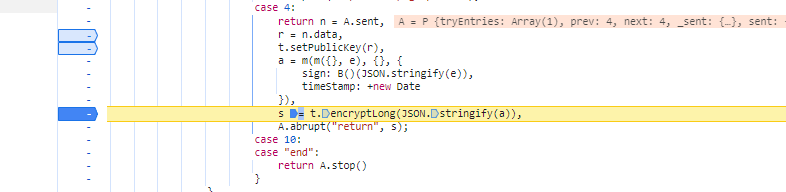

# 目标
- 某集团
- https://ec.minmetals.com.cn -> 采购信息
- 抓包获取信息

- 通过在抓包发现，每次换页的请求发出前都会发出一个 public 请求

- public 返回数据为 str ，大胆猜测，这极有可能是一个公钥。
- 通过全局搜索，对疑似目标打断点进行跟踪

- 抓到疑似目标，确认原始参数
~~~
{
    "inviteMethod": "",
    "businessClassfication": "",
    "mc": "",
    "lx": "ZBGG",
    "dwmc": "",
    "pageIndex": 7,
    "sign": "bbc6a62680c1306979d002fca311b7eb",
    "timeStamp": 1717942167212
}
~~~

- 发现原始参数中包含了 一个 sign 签名，往回追踪。

- 此处发现了public的踪迹以及sign的生成位置。

- 通过断点调试发现 `n.data` 就是 public 中的返回值。
- 通过搜索 加代码顺序往回找最近的一个 `B =` 

~~~
, Q = t("8237")
 , B = t.n(Q)
~~~
- 追踪 t 发现这是一个 webpack 的加载器。
- 取出 Webpack 主体，不要模块部分

- 取到如图所示的 `{` 处，新建一个 js文件,补全头边的括号

- 在最底部让我们定义的外部变量指向内部的加载器

~~~
Q = t("8237") # 现在我们要找的目标是 8237
下方调用 
pointer("8237")
~~~
- 找到8237模块位置，加到模块位置

- 在加载器内部加入一个控制台log

- 执行代码，日志内容，缺啥模块就找到该模块进行补全
- 调试报了个错

- 这可能是一个多文件的 Webpack，先定义一个window，并把 webpackJsonp 置空，发现并不可行。
- 回到浏览器，找到缺失位置，打断点，刷新页面通过控制台输出补全缺失

- 直接右键 copyobject
- 补全window

- 然后继续执行，根据报错缺失，缺啥补啥

- 补了四个模块后 Q 已经被还原

- 补全B 发现无需添加新模块
~~~
sign: B()(JSON.stringify(e)) 
~~~
- 根据sign的生成，还差e
- 断点找e，断点打到如下位置

~~~
e = {
    "inviteMethod": "",
    "businessClassfication": "",
    "mc": "",
    "lx": "ZBGG",
    "dwmc": "",
    "pageIndex": 1
}
~~~
- 通过如下参数进行校验

- 经过比对确认，sign 已经成功被还原生成
- 经过之前的分析，s 即为参数加密后的密文

~~~
r = n.data,
t.setPublicKey(r),
a = m(m({}, e), {}, {
    sign: B()(JSON.stringify(e)),
    timeStamp: +new Date
}),
s = t.encryptLong(JSON.stringify(a)),
~~~
- 通过上边的分析 n.data 为 public 返回的公钥
- 往上找，发现了 `t=new d['a']`、`d = t("9816")`
~~~
d = t("9816")
t = new d["a"]
~~~
- 如法炮制，根据缺啥补啥原则补全

- 补了两个模块后，补全了d
- 调用调试，根据缺啥补啥原则，补全剩余的函数和方法

- 调试生成 参数
~~~
e = {
    "inviteMethod": "",
    "businessClassfication": "",
    "mc": "",
    "lx": "ZBGG",
    "dwmc": "",
    "pageIndex": 2
}
const publick_key = "MIGfMA0GCSqGSIb3DQEBAQUAA4GNADCBiQKBgQCXQpKejn7xBAvNpAGz7uXCZ2p8GmKRgtjSHpTu/60isilrNKEJXEkyghBPijH0X024kDc27X2kAVANuzF7MSzA9G0on0z2nViIaciu5Wq1jMpw+zO/L3DRcZ32djjYje5yJGuU8ATTb9rvegGogN4P5J7OIg6flCY/Xy12oH282QIDAQAB"
console.log(encrypt(publick_key,e))
~~~

- 成功生成了加密参数
- 简单构建模拟发送请求获取数据，参考demo.py
- 尝试使用 excejs 执行 encrypt 
- 经常遇到如下问题

- 遇到这种情况，可以将参数和返回值做 base64 编码处理，或者使用 express 构建Web服务，常规生产环境一般会直接使用后者。
- 暴露模块 `module.exports = encrypt`
- 简单构建 Web服务如下
~~~
// 引入 Express 模块
const express = require('express');
const {response} = require("express");
const encrypt = require("./wbp.js")
const app = express();
const port = 3000;

// 使用 express.json() 中间件来解析 JSON 格式的请求体
app.use(express.json());

// 定义一个路由处理函数
app.post('/encrypt', (req, res) => {
      e = req.body.e
      publick_key = req.body.publick_key
      const param = encrypt(publick_key,e)
      res.json(
          {
                code:0,
                param:param
          }
      )
});

// 启动服务器并监听指定端口
app.listen(port, () => {
  console.log(`Server is running on port ${port}`);
});
~~~
- 启动 api
~~~
node app.js
~~~
- 使用 postman 进行接口测试

- 通过 Demo.py 进行测试，发现触发了网站的安全盾

- 这是因为安全盾检测了浏览器的一些指纹信息，绕过他很简单，使用第三方库 `curl_cffi` 替换 `request`
~~~
from curl_cffi import requests
~~~
- 安全盾不再触发，顺利拿到数据

- 注意！ 该分享只限于学习使用，请勿非法利用！否则后果自负！
