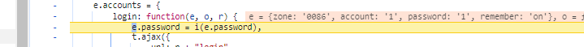
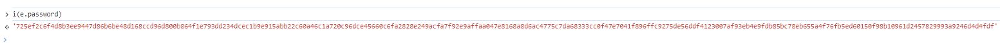

# 目标

- https://tuchong.com/community
- 图虫登录接口：https://tuchong.com/rest/accounts/login
- 仅解密密码加密部分
- 通过设置 XHR 断点定位 /accounts/login
- 往回找数据输入点，重新设置断点，再发请求从明文开始跟栈，最后发现加密点

- 通过控制台输出

- 确认这就是目标
~~~
function i(e) {
        var t = new RSAKey;
        return t.setPublic(o, "10001"),
        t.encrypt(encodeURIComponent(e))
    }
~~~

- 下断点，调试找到 RSAKey部分代码，直接代码调试，验证加密
- 综合来说，还是比较容易得