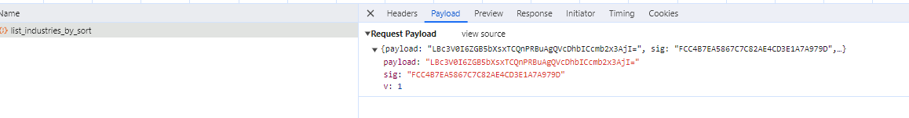
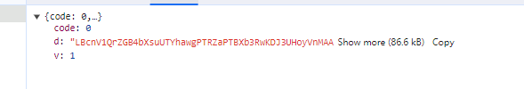
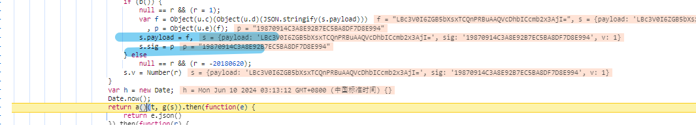

- https://www.xiniudata.com/industry/newest?from=data
- https://www.xiniudata.com/api2/service/x_service/person_industry_list/list_industries_by_sort

- 经过探查发现，参数和返回结果中均存在加密
- 参数加密疑似 md5 和 base64
- 根据 XHR 断点跟踪，发现了 加密参数的生成方式，复原js代码如下

~~~
const crypto = require('crypto');

function calculateMD5(input) {
    // 创建一个md5哈希实例
    const hash = crypto.createHash('md5');

    // 更新哈希值（你需要处理的数据）
    hash.update(input);

    // 计算最终的哈希值
    const digest = hash.digest('hex');

    // 返回哈希值的十六进制字符串
    return digest;
}

const _p = "W5D80NFZHAYB8EUI2T649RT2MNRMVE2O"
const _keyStr = "ABCDEFGHIJKLMNOPQRSTUVWXYZabcdefghijklmnopqrstuvwxyz0123456789+/="
function _u_e(e) {
                if (null == e)
                    return null;
                e = e.replace(/\r\n/g, "\n");
                for (var t = "", n = 0; n < e.length; n++) {
                    var r = e.charCodeAt(n);
                    r < 128 ? t += String.fromCharCode(r) : r > 127 && r < 2048 ? (t += String.fromCharCode(r >> 6 | 192),
                    t += String.fromCharCode(63 & r | 128)) : (t += String.fromCharCode(r >> 12 | 224),
                    t += String.fromCharCode(r >> 6 & 63 | 128),
                    t += String.fromCharCode(63 & r | 128))
                }
                return t
            }
function e1(e) { // u.c
    if (null == e)
        return null;
    for (var t, n, r, o, i, a, u, c = "", l = 0; l < e.length;)
        o = (t = e.charCodeAt(l++)) >> 2,
            i = (3 & t) << 4 | (n = e.charCodeAt(l++)) >> 4,
            a = (15 & n) << 2 | (r = e.charCodeAt(l++)) >> 6,
            u = 63 & r,
            isNaN(n) ? a = u = 64 : isNaN(r) && (u = 64),
            c = c + _keyStr.charAt(o) + _keyStr.charAt(i) + _keyStr.charAt(a) + _keyStr.charAt(u);
    return c
}

function e2(e) { // u.d
    if (null == (e = _u_e(e)))
        return null;
    for (var t = "", n = 0; n < e.length; n++) {
        var r = _p.charCodeAt(n % _p.length);
        t += String.fromCharCode(e.charCodeAt(n) ^ r)
    }
    return t
}

function sig(e) {
    return calculateMD5(e + _p).toUpperCase()
}

payload = {
    "sort": 1,
    "start": 120,
    "limit": 20
}

payload = e1(e2(JSON.stringify(payload))) // s.payload => limit:20 sort:1 start:80
sign = sig(payload);

console.log(payload)
console.log(sign)
~~~
- 通过 hook Json.prase 跟踪堆栈发现响应数据解密位置，倒退替换，还原出以下代码

~~~
const _p = "W5D80NFZHAYB8EUI2T649RT2MNRMVE2O"
const _keyStr = "ABCDEFGHIJKLMNOPQRSTUVWXYZabcdefghijklmnopqrstuvwxyz0123456789+/="
function _u_d(e) {
                for (var t = "", n = 0, r = 0, o = 0, i = 0; n < e.length; )
                    (r = e.charCodeAt(n)) < 128 ? (t += String.fromCharCode(r),
                    n++) : r > 191 && r < 224 ? (o = e.charCodeAt(n + 1),
                    t += String.fromCharCode((31 & r) << 6 | 63 & o),
                    n += 2) : (o = e.charCodeAt(n + 1),
                    i = e.charCodeAt(n + 2),
                    t += String.fromCharCode((15 & r) << 12 | (63 & o) << 6 | 63 & i),
                    n += 3);
                return t
            }
function d2(e) {
                for (var t = "", n = 0; n < e.length; n++) {
                    var r = _p.charCodeAt(n % _p.length);
                    t += String.fromCharCode(e.charCodeAt(n) ^ r)
                }
                return t = _u_d(t)
            }
function d1(e) {
    var t, n, r, o, i, a, u = "", c = 0;
    for (e = e.replace(/[^A-Za-z0-9\+\/\=]/g, ""); c < e.length; )
        t = _keyStr.indexOf(e.charAt(c++)) << 2 | (o = _keyStr.indexOf(e.charAt(c++))) >> 4,
        n = (15 & o) << 4 | (i = _keyStr.indexOf(e.charAt(c++))) >> 2,
        r = (3 & i) << 6 | (a = _keyStr.indexOf(e.charAt(c++))),
        u += String.fromCharCode(t),
        64 != i && (u += String.fromCharCode(n)),
        64 != a && (u += String.fromCharCode(r));
    return u
}

s=? 密文

d = d1(s)
y = d2(d)

console.log(JSON.parse(y)
~~~
- 总得来说没有什么太大难度，主要是定位，高效的定位，加密部分较为简单，直接寻找替换即可。