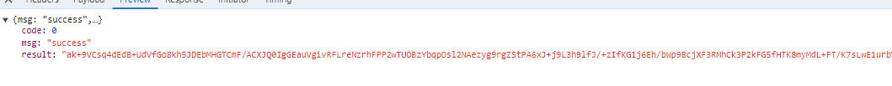
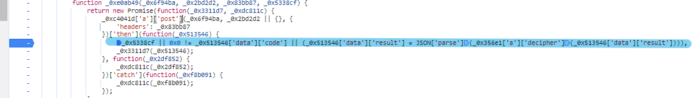
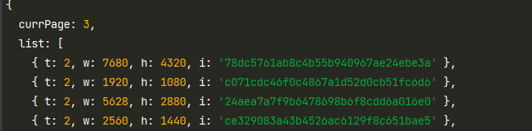

- https://bz.zzzmh.cn/index
- https://api.zzzmh.cn/bz/v3/getData
- 经过抓包探查，发现返回数据为密文

- 通过设置 XHR 断点，发现此处做了一个跳转

- 发现目标密文位置

~~~
(_0x513546['data']['result'] = JSON['parse'](_0x356e1['a']['decipher'](_0x513546['data']['result']))),
~~~
- 通过控制台调试
~~~
JSON['parse'](_0x356e1['a']['decipher'](_0x513546['data']['result']))

_0x513546['data']['result'] -> 密文数据 
~~~
- 发现此处将密文转换成了明文
- 直接开始扣代码
~~~
 _0x356e1['a']['decipher'] 找到对应的函数位置
~~~
- 然后根据缺啥补啥的原则，补全代码
- 最后还原代码参考 demo.js
