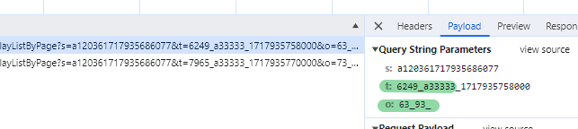

# 目标
- http://tzxm.jxzwfww.gov.cn/icity/ipro/open/publicity'
- 经过探查发现有部分参数进行了加密处理

- 通过全局搜索关键字 `encrypt(` 虽然不是执行代码不过竟然意外命中了？
- 竟然还留了了注释 , 看样子在这个网站疑似大学生套模板改的，竟然练模板图标都懒得替换...
~~~
        var sig = "";
            var chars = "0123456789abcdef";
            if(!LEx.isNotNull(__signature)){
                var curTime = parseInt(Math.random()*(9999-1000+1)+1000)+""+Date.parse(new Date());
                sig = chars.charAt(parseInt(Math.random()*(15-15+1)+10))+chars.charAt(curTime.length)+""+curTime;
            }else{
                sig = __signature;
            }

            var key = "";
            var keyIndex = -1;
            for(var i=0;i<6;i++){
                var c=sig.charAt(keyIndex+1);
                key +=c;
                keyIndex = chars.indexOf(c);
                if(keyIndex<0 || keyIndex>=sig.length){
                    keyIndex = i;
                }
            }

            var timestamp = parseInt(Math.random()*(9999-1000+1)+1000)+"_"+key+"_"+Date.parse(new Date());
			
			var tkey = "";
            var tkeyIndex = -1;
            for(var i=0;i<6;i++){
                var c=timestamp.charAt(tkeyIndex+1);
                tkey +=c;
                tkeyIndex = chars.indexOf(c);
                if(tkeyIndex<0 || tkeyIndex>=timestamp.length){
                    tkeyIndex = i;
                }
            }
			
            var t = timestamp;//LEx.azdg.encrypt(timestamp,key);
            t = t.replace(/\+/g,"_");
            curUrl+= "?s=" + sig;
            curUrl+= "&t=" +  t;
			curUrl+= "&o=" + tkey;
~~~

- 整体逻辑比较简单，阅读代码，直接使用 python 对加密逻辑进行还原。
~~~
def gen_o(t):
    tkeyIndex = -1
    chars = "0123456789abcdef"
    str_list = []
    for i in range(6):
        c = t[tkeyIndex + 1]
        str_list.append(c)
        tkeyIndex = chars.index(c) if c in chars else -1
        if tkeyIndex < 0 or tkeyIndex > len(t):
            tkeyIndex = i
    o = "".join(str_list)
    return o
~~~
- 详细参考 demo.py